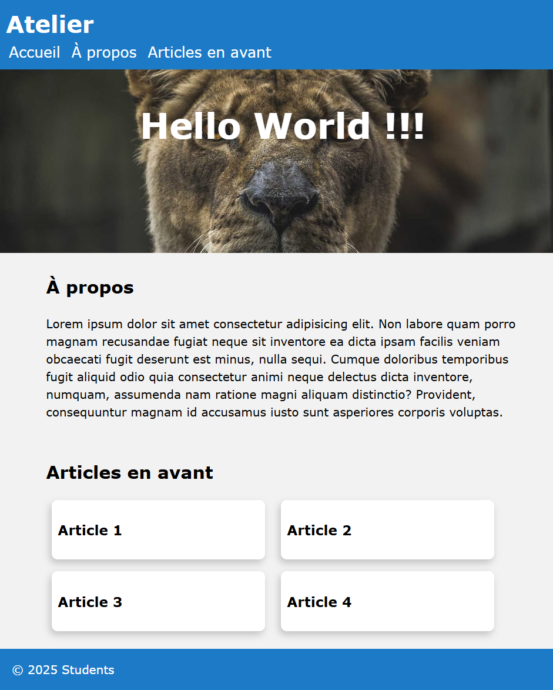

# Atelier sur les bases de HTML/CSS

Règles pour cet atelier : construire et concevoir une page web uniquement avec une structure HTML sémantique (pas de classe, pas d'ID en CSS).

## Initialisation

- Dans un nouveau dossier, créez un fichier *index.html*.
- Ouvrez le fichier avec votre IDE préféré et ajoutez les balises de base de HTML5 (DOCTYPE, html, head, body).
- Créez un fichier *style.css*.
- Dans la balise `<head>`, ajoutez d'abord quelques balises obligatoires comme `<meta>` ou `<title>` :
  ```html
  <head>
    <meta charset="UTF-8">
    <meta name="viewport" content="width=device-width, initial-scale=1.0">
    <title>Atelier CSS</title>
  </head>
  ```
- Ajoutez ensuite une balise `<link>` avec le lien vers *style.css*.
- Dans *index.html*, dans la balise `<body>`, ajoutez une balise `<h1>` avec le texte `Hello world !!!`.
- Dans *style.css*, ajoutez le code suivant :
  ```css
  h1 {
    color: #1175c3; 
  }
  ```
- Ouvrez *index.html* dans votre navigateur et vérifiez que le message "Hello world !!!" s'affiche en bleu.

Bon travail !

## Mise en page de votre site

Vous devrez créer une page d'accueil de base en suivant la mise en page ci-dessous (**ne cherchez pas** à être pixel-perfect, cette image est juste un guide).

<a href="./desktop_layout.png" target="_blank">Ouvrir dans un nouvel onglet <i class="bi bi-box-arrow-up-right"></i></a>  


Les navigateurs appliquent par défaut des tailles pour chaque élément HTML (marges, taille de police, etc.). Cela peut être utile, mais parfois il est préférable de réinitialiser certains comportements. Dans cet atelier, il peut être intéressant de supprimer la marge sur `<body>`. De plus, utiliser `box-sizing: border-box` sur chaque élément vous aidera à gérer la taille des éléments (plus d'infos sur [box-sizing](https://developer.mozilla.org/en-US/docs/Web/CSS/box-sizing)).
```css
* {
  box-sizing: border-box;
}
body {
  margin: 0;
}
```

### Barre de navigation

- Essayez de reproduire la barre de navigation. Commencez par créer une balise `<nav>` et ajoutez la couleur de fond `#1175c3`.
- Ensuite, analysez la structure de la barre de navigation. Vous avez "Workshop" en haut à gauche et un groupe d'éléments de menu en dessous.
- Utiliser une liste non ordonnée peut être une bonne idée pour le groupe de menus, mais n'oubliez pas de l'afficher horizontalement et sans puces.

### En-tête

- Encapsulez votre balise `<h1>` dans une balise `<header>` et ajoutez une hauteur minimale de 250px.
- Ajoutez une image d'arrière-plan (par exemple une image aléatoire depuis [Loremflicker](https://loremflickr.com/1920/600) ou [Picsum](https://picsum.photos/1920/600)).
- Centrez votre titre principal et ajustez la taille et la couleur de la police si nécessaire.

> Astuce : [Gérer la taille de l'arrière-plan](https://developer.mozilla.org/en-US/docs/Web/CSS/background-size)

### Section "À propos de nous"

- Il est préférable d'encapsuler les sections dans une balise `<main>`.
- Ajoutez une première `<section>` et un `<h2>` conformément au modèle.
- Ajoutez du texte fictif dans un paragraphe. Changez la `line-height` (1.5) et la `font-family` (Verdana) pour améliorer la lisibilité. Cela peut être fait dans les propriétés de `body`.
- Limitez la `max-width` à 65ch. Cela garantira une largeur de texte ne dépassant pas 85 caractères, rendant la lecture plus confortable.
  > Une explication : en CSS, l'unité `ch` est relative à la largeur du caractère "0" (le plus large dans la plupart des polices). Spécifier 65ch permet d'assurer une largeur de colonne comprise entre 65 et 85 caractères, une recommandation fréquente pour l'accessibilité numérique et l'ergonomie de lecture. Plus d'explications dans [cet article](https://medium.com/@matuzo/writing-css-with-accessibility-in-mind-8514a0007939) ou [celui-ci](https://www.smashingmagazine.com/2014/09/balancing-line-length-font-size-responsive-web-design/#line-length-measure-and-reading).
- Enfin, vous pouvez utiliser la propriété `margin` pour centrer le bloc horizontalement.

[Guide complet sur le centrage en CSS](https://css-tricks.com/centering-css-complete-guide/)

### Section "Articles en avant"

- Ajoutez une nouvelle section.
- Ajoutez un `<h2>` avec un texte approprié.
- Ajoutez 4 balises `<article>` en tant qu'enfants.
- Chaque article doit contenir un `<h3>` affichant son nom.
- Ajustez la mise en page pour obtenir 2 éléments par ligne avec les propriétés `display` et `width`.
- Les effets d'arrondi et d'ombre portée peuvent être réalisés avec `border-radius` et `box-shadow`.

### Pied de page

Puisque vous avez un `<header>`, vous avez aussi besoin d'un `<footer>`. Cela ne devrait pas poser de problème 😉.
